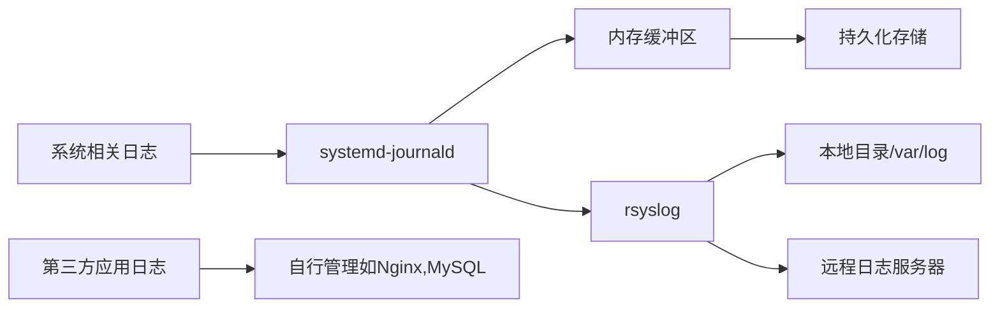

# CentOS Linux 系统日志管理

## 一、日志系统基础

### 1. 日志系统组成

- **systemd-journald**：二进制日志收集器，临时存储`/run/log/journal/` `/etc/systemd/journald.conf`
- **rsyslog**：传统 syslog 实现，负责持久化存储`/var/log/` `/etc/rsyslog.conf`
- **应用自身日志**：如 Nginx、MySQL 等服务的独立日志

- **logrotate**：日志轮转工具，防止日志文件过大（可针对系统相关的日志文件，和其它应用程序的日志文件）



### 2. 主要日志文件位置（rsyslog）

| 日志文件          | 用途描述                                                     |
| ----------------- | ------------------------------------------------------------ |
| /var/log/messages | 主日志文件，常规系统消息（重要）                             |
| /var/log/secure   | 安全认证相关日志（login,su,passwd,SSH登录等）                |
| /var/log/cron     | 计划任务执行日志（cron,at）                                  |
| /var/log/boot.log | 系统启动日志                                                 |
| /var/log/dmesg    | 内核环缓冲区日志                                             |
| /var/log/maillog  | 邮件系统日志                                                 |
| /var/log/httpd/   | Apache Web服务器日志（自主管理，位置、日志格式都可以自定义） |
| /var/log/mysql/   | MySQL数据库日志（自主管理，位置、日志格式都可以自定义）      |

```bash
文本文件，人类可读的文件：
[root@bogon ~]# tail -n2 /var/log/secure
Jun 25 16:00:09 bogon sshd[35693]: pam_unix(sshd:session): session opened for user tom by (uid=0)
Jun 25 16:01:02 bogon login: pam_unix(login:session): session closed for user root

[root@bogon ~]# grep -i  'fail' /var/log/secure
Jun 25 09:39:09 bogon sshd[30416]: pam_systemd(sshd:session): Failed to release session: Interrupted system call
Jun 25 15:17:36 bogon unix_chkpwd[34737]: password check failed for user (tom)
Jun 25 15:17:36 bogon gdm-password]: pam_unix(gdm-password:auth): authentication failure; logname= uid=0 euid=0 tty=/dev/tty1 ruser= rhost=  user=tom

[root@bogon ~]# tailf /var/log/secure
```

### 3. 了解日志设备（Facility）

​	 在 CentOS Linux 系统中，日志设备（Logging Facility）是日志管理的核心概念之一，它定义了日志 **消息的来源** 类别，帮助系统管理员分类和管理不同组件生成的日志，如内核、邮件服务、认证系统等。  

| **Facility 编号** | **Facility 名称**   | **说明**                                |
| ----------------- | ------------------- | --------------------------------------- |
| 0                 | `kern`              | 内核日志（由内核生成的消息）            |
| 1                 | `user`              | 用户级应用程序日志                      |
| 2                 | `mail`              | 邮件系统日志（如 Postfix、Sendmail）    |
| 3                 | `daemon`            | 系统守护进程（如 sshd、httpd）          |
| 4                 | `auth`              | 认证/安全日志（如 PAM、sudo、SSH 登录） |
| 5                 | `syslog`            | `syslogd` 自身生成的日志                |
| 6                 | `lpr`               | 打印服务日志（已较少使用）              |
| 7                 | `news`              | 新闻组服务（已较少使用）                |
| 8                 | `uucp`              | UUCP 协议日志（已较少使用）             |
| 9                 | `cron`              | 计划任务日志（cron/at）                 |
| 10                | `authpriv`          | 私有认证日志（如 sudo、su）             |
| 11                | `ftp`               | FTP 服务日志                            |
| 12-15             | `local0` - `local7` | **自定义日志设备**（供应用程序使用）    |

### 4. 了解日志优先级（Priority）

​	日志优先级（Priority）用于标识日志消息的 **严重程度**，从最低的 **调试信息（debug）** 到最高的 **紧急事件（emerg）**。  

| **优先级编号** | **优先级名称**         | **说明**                 | **典型使用场景**             |
| -------------- | ---------------------- | ------------------------ | ---------------------------- |
| 0              | `emerg` (Emergency)    | **系统不可用**（最严重） | 系统崩溃、硬件故障           |
| 1              | `alert` (Alert)        | **需要立即处理**         | 关键服务失败、安全事件       |
| 2              | `crit` (Critical)      | **严重错误**             | 数据库崩溃、磁盘满           |
| 3              | `err` (Error)          | **一般错误**             | 服务启动失败、权限问题       |
| 4              | `warning` (Warning)    | **警告**                 | 非关键问题（如磁盘空间不足） |
| 5              | `notice` (Notice)      | **重要但非错误**         | 正常但需注意的事件           |
| 6              | `info` (Informational) | **普通信息**             | 服务启动、配置加载           |
| 7              | `debug` (Debug)        | **调试信息**             | 开发/排错时使用              |

```bash
cron.err				计划任务设备.err级别的日志
authpriv.emerg			认证设备.emerg级别的日志
mail.none				邮件设备.排除
*.emerg					任何设备.emerg级别的日志

程序：su,passwd,login(本地登录)，ssh(远程登录)
它们所使用的日志设备都是：`authpriv`

程序：crond(周期性计划任务),at（一次性计划任务）
它们所使用的日志设备都是：`cron`

1. 应用程序自身会产生日志：[开发人员定义的]
比如，计划任务服务crond，在运行过程中，会产生相应设备（`cron`）及相应等级的日志。
比如，当使用passwd tianyun修改密码时，passwd程序会产生设备（`authpriv`）及相应等级的日志。
比如，客户端使用ssh远程登录该服务器，sshd程序会产生设备（`authpriv`）及相应等级的日志。

2.手动产生了一条日志：
[root@bogon ~]# logger -p cron.emerg "yangge run................."
Broadcast message from systemd-journald@bogon (Thu 2025-06-26 10:13:25 CST):
root[50976]: yangge run.................

[root@bogon ~]# logger -p cron.info "yangge cron info.............."

[root@bogon ~]# logger -p authpriv.info "yangge authpriv info.............."

[root@bogon ~]# logger -p authpriv.error "yangge authpriv error.............."

[root@bogon ~]# tail -n5 /var/log/secure
[root@bogon ~]# tail -n5 /var/log/cron
```

## 二、rsyslog日志服务

### 1. rsyslog 配置

主配置文件：`/etc/rsyslog.conf`

```bash
[root@bogon ~]# vim /etc/rsyslog.conf
#### RULES ####
*.info;mail.none;authpriv.none;cron.none                /var/log/messages

authpriv.*                                              /var/log/secure

# - 表示 异步写入（日志先写入缓冲区，再写入磁盘，提高性能，但可能在系统崩溃时丢失少量日志）
mail.*                                                  -/var/log/maillog
cron.*                                                  /var/log/cron

# 将所有emerg（紧急）级别的日志消息发送到所有已登录的用户终端
*.emerg                                                 :omusrmsg:*

uucp,news.crit                                          /var/log/spooler
local7.*                                                /var/log/boot.log
```

### 2. rsyslog 日志查看

```bash
[root@bogon ~]# tail /var/log/cron
Jun 26 10:01:01 bogon run-parts(/etc/cron.hourly)[50801]: starting 0anacron
Jun 26 10:01:01 bogon run-parts(/etc/cron.hourly)[50814]: finished 0anacron
Jun 26 10:01:01 bogon run-parts(/etc/cron.hourly)[50801]: starting mcelog.cron
Jun 26 10:01:01 bogon run-parts(/etc/cron.hourly)[50820]: finished mcelog.cron
Jun 26 10:10:01 bogon CROND[50929]: (root) CMD (/usr/lib64/sa/sa1 1 1)
Jun 26 10:13:25 bogon root: yangge run.................
Jun 26 10:20:01 bogon CROND[51087]: (root) CMD (/usr/lib64/sa/sa1 1 1)
Jun 26 10:30:02 bogon CROND[51185]: (root) CMD (/usr/lib64/sa/sa1 1 1)
Jun 26 10:40:01 bogon CROND[51344]: (root) CMD (/usr/lib64/sa/sa1 1 1)
Jun 26 10:50:01 bogon CROND[51441]: (root) CMD (/usr/lib64/sa/sa1 1 1)

# 查看内核日志
dmesg | less

# 查看登录记录
last
lastb  # 查看失败登录尝试
```

### 3. rsyslog 日志查看的不足

```bash
例如有这一样些需求：
1. 查看3天内的安全日志
2. 查看所有设备日志等级为err及以上等级的日志
3. 查看sshd服务等级为err及以上等级的日志
```


### **4.远程收集日志**

**Server端：**

`vi /etc/rsyslog.conf`

`$ModLoad imudp` 
`$UDPServerRun 514`

配置文件最后：

`$template RemoteLog,"/var/log/%FROMHOST-IP%/%PROGRAMNAME%.log"                               
*.* ?RemoteLog`

 `systemctl restart rsyslog`


**client：**

`$ActionQueueFileName fwdRule1` 
`$ActionQueueMaxDiskSpace 1g   
$ActionQueueSaveOnShutdown on  
$ActionQueueType LinkedList    
$ActionResumeRetryCount -1` 
`*.* @192.168.31.80`

`systemctl restart rsyslog`


**解释：**

`$ActionQueueFileName fwdRule1` 

定义队列的磁盘持久化文件名（前缀）。- 当队列需要写入磁盘（如内存不足、系统关机）时，会生成以 `fwdRule1` 为前缀的文件（如 `fwdRule1.00000001`），重启后可恢复队列数据。

$ActionQueueMaxDiskSpace 1g 

限制队列占用的最大磁盘空间（1GB）。

$ActionQueueSaveOnShutdown on 

 关机时保存队列 功能。

$ActionQueueType LinkedList

防止系统崩溃数据丢失。

$ActionResumeRetryCount -1

设置队列恢复时的重试次数为 “无限重试”（`-1` 表示一直试）。


##  三、systemd-journald日志服务

### 1. 基本查看日志

```bash
[root@bogon ~]# journalctl 				# 查看所有的日志（所有设备，所有级别）
-- Logs begin at Thu 2025-06-12 10:02:31 CST, end at Thu 2025-06-26 10:50:01 CST. --
Jun 12 10:02:31 localhost.localdomain systemd-journal[92]: Runtime journal is using 8.0M (max allowed 90.9M, trying 
Jun 12 10:02:31 localhost.localdomain kernel: Initializing cgroup subsys cpuset
Jun 12 10:02:31 localhost.localdomain kernel: Initializing cgroup subsys cpu
Jun 12 10:02:31 localhost.localdomain kernel: Initializing cgroup subsys cpuacct

[root@bogon ~]# journalctl -n			# 查看最近10条，也可以-n 5
-- Logs begin at Thu 2025-06-12 10:02:31 CST, end at Thu 2025-06-26 10:50:01 CST. --
Jun 26 10:25:13 bogon avahi-daemon[755]: Received response from host 192.168.1.104 with invalid source port 54762 on
Jun 26 10:25:14 bogon avahi-daemon[755]: Received response from host 192.168.1.104 with invalid source port 54762 on
Jun 26 10:25:17 bogon avahi-daemon[755]: Received response from host 192.168.1.104 with invalid source port 54762 on
Jun 26 10:30:01 bogon systemd[1]: Started Session 377 of user root.
Jun 26 10:30:02 bogon CROND[51185]: (root) CMD (/usr/lib64/sa/sa1 1 1)
Jun 26 10:40:01 bogon systemd[1]: Started Session 378 of user root.
Jun 26 10:40:01 bogon CROND[51344]: (root) CMD (/usr/lib64/sa/sa1 1 1)
Jun 26 10:40:58 bogon avahi-daemon[755]: Received response from host 192.168.1.104 with invalid source port 54762 on
Jun 26 10:50:01 bogon systemd[1]: Started Session 379 of user root.
Jun 26 10:50:01 bogon CROND[51441]: (root) CMD (/usr/lib64/sa/sa1 1 1)

[root@bogon ~]# journalctl -f			# 动态查看最新的日志
-- Logs begin at Thu 2025-06-12 10:02:31 CST. --
Jun 26 10:25:13 bogon avahi-daemon[755]: Received response from host 192.168.1.104 with invalid source port 54762 on interface 'ens33.0'
Jun 26 10:25:14 bogon avahi-daemon[755]: Received response from host 192.168.1.104 with invalid source port 54762 on interface 'ens33.0'
Jun 26 10:25:17 bogon avahi-daemon[755]: Received response from host 192.168.1.104 with invalid source port 54762 on interface 'ens33.0'
Jun 26 10:30:01 bogon systemd[1]: Started Session 377 of user root.
Jun 26 10:30:02 bogon CROND[51185]: (root) CMD (/usr/lib64/sa/sa1 1 1)
Jun 26 10:40:01 bogon systemd[1]: Started Session 378 of user root.
Jun 26 10:40:01 bogon CROND[51344]: (root) CMD (/usr/lib64/sa/sa1 1 1)
Jun 26 10:40:58 bogon avahi-daemon[755]: Received response from host 192.168.1.104 with invalid source port 54762 on interface 'ens33.0'
Jun 26 10:50:01 bogon systemd[1]: Started Session 379 of user root.
Jun 26 10:50:01 bogon CROND[51441]: (root) CMD (/usr/lib64/sa/sa1 1 1)

此时，可以从别的终端产生日志，例如登录系统，可以测试成功或失败。

[root@bogon ~]# journalctl -p err		# 指定日志的优先级
-- Logs begin at Thu 2025-06-12 10:02:31 CST, end at Thu 2025-06-26 11:01:01 CST. --
Jun 12 10:02:31 localhost.localdomain kernel: Detected CPU family 6 model 140 stepping 2
Jun 12 10:02:31 localhost.localdomain kernel: Warning: Intel Processor - this hardware has not undergone upstream te
Jun 12 10:02:32 localhost.localdomain kernel: sd 0:0:0:0: [sda] Assuming drive cache: write through

[root@bogon ~]# journalctl -p emerg		# 查看优先级为emerg的日志
-- Logs begin at Thu 2025-06-12 10:02:31 CST, end at Thu 2025-06-26 11:01:01 CST. --
Jun 25 15:22:32 bogon root[35181]: run.................
Jun 25 15:23:33 bogon root[35190]: run....run.............
Jun 26 10:13:25 bogon root[50976]: yangge run.................

[root@bogon ~]# journalctl -u sshd.service 	# 指定systemd单元,UNIT
-- Logs begin at Thu 2025-06-12 10:02:31 CST, end at Thu 2025-06-26 11:05:34 CST. --
Jun 12 10:02:46 bogon systemd[1]: Starting OpenSSH server daemon...
Jun 12 10:02:46 bogon sshd[1236]: Server listening on 0.0.0.0 port 22.
Jun 12 10:02:46 bogon sshd[1236]: Server listening on :: port 22.
Jun 12 10:02:46 bogon systemd[1]: Started OpenSSH server daemon.
Jun 12 10:03:33 bogon sshd[2843]: Address 192.168.92.1 maps to bogon, but this does not map back to the address - PO
Jun 12 10:03:35 bogon sshd[2843]: Accepted password for root from 192.168.92.1 port 58663 ssh2

[root@tianyun ~]# journalctl -f -u sshd.service		# 指定systemd单元,UNIT，动态查看
[root@tianyun ~]# journalctl -f -u apache

[root@tianyun ~]# journalctl -S "15:00"				# 等价于--since
-- Logs begin at Mon 2025-07-28 09:10:49 CST, end at Mon 2025-07-28 15:12:25 CST. --
Jul 28 15:01:01 tianyun systemd-journal[516]: Time spent on flushing to /var is 25.081ms for 2795 entries.
Jul 28 15:01:01 tianyun systemd[1]: Started Session 21 of user root.
Jul 28 15:01:01 tianyun CROND[19752]: (root) CMD (run-parts /etc/cron.hourly)
Jul 28 15:01:01 tianyun run-parts(/etc/cron.hourly)[19755]: starting 0anacron
Jul 28 15:01:01 tianyun run-parts(/etc/cron.hourly)[19761]: finished 0anacron
```

### 2. 高级查看日志

```bash
-S, --since=, -U, --until=
时间参数："YYYY-MM-DD hh:mm:ss"
yesterday、today、tomorrow

[root@bogon ~]# journalctl --since today					# 查看今天所有的日志
-- Logs begin at Thu 2025-06-12 10:02:31 CST, end at Thu 2025-06-26 11:10:01 CST. --
Jun 26 00:00:01 bogon systemd[1]: Starting update of the root trust anchor for DNSSEC validation in unbound...
Jun 26 00:00:01 bogon systemd[1]: Started Session 299 of user root.
Jun 26 00:00:01 bogon CROND[41152]: (root) CMD (/usr/lib64/sa/sa1 1 1)
Jun 26 00:00:01 bogon systemd[1]: Started update of the root trust anchor for DNSSEC validation in unbound.
Jun 26 00:01:01 bogon systemd[1]: Started Session 300 of user root.
Jun 26 00:01:01 bogon CROND[41174]: (root) CMD (run-parts /etc/cron.hourly)

[root@bogon ~]# journalctl --since today -u sshd.service 	# 今天，sshd服务的日志
-- Logs begin at Thu 2025-06-12 10:02:31 CST, end at Thu 2025-06-26 11:10:01 CST. --
Jun 26 09:55:59 bogon sshd[50530]: pam_unix(sshd:auth): authentication failure; logname= uid=0 euid=0 tty=ssh ruser=
Jun 26 09:55:59 bogon sshd[50530]: pam_succeed_if(sshd:auth): requirement "uid >= 1000" not met by user "root"

[root@bogon ~]# journalctl --since "2025-06-24" --until "2025-06-26 10:00" 
-- Logs begin at Thu 2025-06-12 10:02:31 CST, end at Thu 2025-06-26 11:10:01 CST. --
Jun 24 18:23:07 bogon systemd[1]: Time has been changed
Jun 24 18:23:07 bogon systemd[1]: Starting update of the root trust anchor for DNSSEC validation in unbound...
Jun 24 18:23:07 bogon systemd[1]: Stopped target Bluetooth.

# 从2025-06-24 00:00:00 到 2025-06-26 10:00:00，sshd服务的日志
[root@bogon ~]# journalctl --since "2025-06-24" --until "2025-06-26 10:00" -u sshd.service -p err
-- Logs begin at Thu 2025-06-12 10:02:31 CST, end at Thu 2025-06-26 11:10:01 CST. --
Jun 25 08:54:17 bogon sshd[29591]: Address 192.168.1.109 maps to bogon, but this does not map back to the address - 
Jun 25 08:54:19 bogon sshd[29591]: Accepted password for root from 192.168.1.109 port 56947 ssh2
Jun 25 09:38:56 bogon sshd[30416]: Address 192.168.1.109 maps to bogon, but this does not map back to the address - 
Jun 25 09:38:56 bogon sshd[30416]: Accepted password for root from 192.168.1.109 port 59262 ssh2

[root@bogon ~]# journalctl --since "-1 hour"	# 最近1小时的日志
-- Logs begin at Thu 2025-06-12 10:02:31 CST, end at Thu 2025-06-26 11:10:01 CST. --
Jun 26 10:16:46 bogon systemd[1]: Starting Cleanup of Temporary Directories...
Jun 26 10:16:46 bogon systemd[1]: Started Cleanup of Temporary Directories.

[root@bogon ~]# journalctl --since "-2 hour" -u sshd.service # sshd服务最近2小时的日志
-- Logs begin at Thu 2025-06-12 10:02:31 CST, end at Thu 2025-06-26 11:10:01 CST. --
Jun 26 09:55:59 bogon sshd[50530]: pam_unix(sshd:auth): authentication failure; logname= uid=0 euid=0 tty=ssh ruser=

[root@bogon ~]# journalctl --since "-10 min" 	# 最近10分钟
-- Logs begin at Thu 2025-06-12 10:02:31 CST, end at Thu 2025-06-26 11:10:01 CST. --
Jun 26 11:10:01 bogon systemd[1]: Started Session 382 of user root.
Jun 26 11:10:01 bogon CROND[51807]: (root) CMD (/usr/lib64/sa/sa1 1 1)


[root@bogon ~]# journalctl --since "-1 hour"		# 最近1小时的日志
[root@bogon ~]# journalctl --since "1 hour ago"		# 最近1小时的日志

[root@bogon ~]# journalctl --since "-10 min" 		# 最近10分钟
[root@bogon ~]# journalctl --since "10 min ago" 	# 最近10分钟


#扩展使用
_COMM			命令名称
_PID			进程PID
_UID			运行进程的用户UID
_SYSTEM_UNIT	启动该进程的systemd单，等价于-u sshd.sevice

[root@bogon ~]# journalctl _UID=0
[root@bogon ~]# journalctl _UID=0 -u sshd.service

[root@bogon ~]# journalctl _UID=0 _SYSTEMD_UNIT=sshd.service
[root@bogon ~]# journalctl _UID=0 -u sshd.service

# 跟踪特定进程日志
journalctl _PID=1111 -f
```

### 3. 配置持久化【可选】

主配置文件 `/etc/systemd/journald.conf`关键参数：

```ini
[Journal]
Storage=persistent           # 持久化模式(auto|persistent|volatile)
Compress=yes                 # 启用压缩
Seal=yes                     # 数据签名校验
SystemMaxUse=1G              # 最大磁盘用量
RuntimeMaxUse=200M           # 内存用量限制
MaxRetentionSec=1month       # 最长保留时间
SystemMaxFiles=100           # 最大日志文件数
```

```bash
# 重启systemd-jounald服务
systemctl restart systemd-journald		

# 查看持久化的日志文件
[root@bogon ~]# ls /var/log/journal/
a18400dc947a4b54baab4731f8733247

[root@tianyun ~]# journalctl --list-boots
-1 acc1e95e388646c69f2740e53908f377 Mon 2025-07-28 09:10:49 CST—Mon 2025-07-28 15:03:43 CST
 0 21b7732cdd6640b593fba699678bfeed Mon 2025-07-28 15:03:50 CST—Mon 2025-07-28 15:06:43 CST
 
# 启动过程分析
journalctl -b -0            # 本次启动
journalctl -b -1            # 上次启动
```

# CentOS logrotate 日志轮转

## 一、logrotate 基本概念

logrotate 是 Linux 系统自带的日志轮转工具，主要功能包括：
- 自动轮转日志文件
- 压缩旧日志节省空间
- 删除过期的日志文件
- 按大小或时间触发轮转
- 轮转后执行自定义命令

```bash
[root@bogon ~]# ls -il /var/log/secure*
35462267 -rw-------. 1 root root 10439 Jun 26 11:00 /var/log/secure
35419593 -rw-------. 1 root root 54613 Jun 16 08:56 /var/log/secure-20250616
35145418 -rw-------. 1 root root  1250 Jun 16 11:08 /var/log/secure-20250624

[root@bogon ~]# logrotate -f /etc/logrotate.conf	# 手动全部轮转
	
[root@bogon ~]# ls -il /var/log/secure*
35144061 -rw-------. 1 root root     0 Jun 26 14:47 /var/log/secure
35419593 -rw-------. 1 root root 54613 Jun 16 08:56 /var/log/secure-20250616
35145418 -rw-------. 1 root root  1250 Jun 16 11:08 /var/log/secure-20250624
35462267 -rw-------. 1 root root 10439 Jun 26 11:00 /var/log/secure-20250626

说明：
轮转前secure文件inode：35462267
轮转后inode：35462267 改名成了secure-20250626。新创建了secure，分配了新的inode 35144061

由于新创建的文件不是原来的inode，所以`有可能`需要通知相应进程，使用新的文件。
```

## 二、配置文件结构

### 2.1 主配置文件
`/etc/logrotate.conf` - 全局默认配置

```bash
# 全局默认配置
weekly          # 每周轮转一次
rotate 4        # 保留4个旧日志
create          # 轮转后创建新文件
dateext         # 使用日期作为后缀
compress        # 压缩旧日志
include /etc/logrotate.d  # 包含子配置目录
```

### 2.2 子配置文件
`/etc/logrotate.d/` - 应用特定的配置

```bash
[root@bogon ~]# ls /etc/logrotate.d/
bootlog   cups   iscsiuiolog     libvirtd.qemu   ppp   samba    wpa_supplicant
chrony    firewalld    libvirtd    numad     psacct    syslog      yum

[root@bogon ~]# cat /etc/logrotate.d/syslog 	# 针对rsyslog服务的
/var/log/cron
/var/log/maillog
/var/log/messages
/var/log/secure
/var/log/spooler
{
    missingok
   
    sharedscripts								# 轮转后要执行的脚本
    postrotate				
        /bin/kill -HUP `cat /var/run/syslogd.pid 2> /dev/null` 2> /dev/null || true
    endscript
}

比如/var/log/cron、/var/log/secure等上面的5个日志文件，哪个进程会往里面写日志？
rsyslog.service

[root@bogon ~]# cat /var/run/syslogd.pid		# 获取rsyslog PID
50756
[root@bogon ~]# ps aux |grep rsyslog			# 同样是获取rsyslog PID
root      50756  0.0  0.1 239124  3432 ?        Ssl  09:58   0:01 /usr/sbin/rsyslogd -n

# /bin/kill -HUP `cat /var/run/syslogd.pid 2> /dev/null`
重新加载rsyslog服务，如此以来它重新去加载日志文件
```

## 三、配置参数详解

### 3.1 触发条件参数
| 参数        | 说明                |
| ----------- | ------------------- |
| daily       | 每天轮转            |
| weekly      | 每周轮转            |
| monthly     | 每月轮转            |
| size 100M   | 日志超过100MB时轮转 |
| minsize 10M | 至少达到10M         |

### 3.2 文件处理参数
| 参数          | 说明                                      |
| ------------- | ----------------------------------------- |
| rotate 7      | 保留7个旧日志文件                         |
| compress      | 使用gzip压缩旧日志                        |
| delaycompress | 延迟压缩(下次轮转时压缩)                  |
| dateext       | 使用日期作为后缀(如.log-20250625)         |
| missingok     | 日志不存在时不报错                        |
| notifempty    | 空日志不轮转                              |
| create        | 轮转后创建新文件，create 0644 nginx nginx |

## 四、轮转实战案例

### 4.1 安装Nginx软件

```bash
[root@bogon ~]# yum -y install nginx
[root@bogon ~]# systemctl start nginx
[root@bogon ~]# systemctl enable nginx

从浏览器测试访问，可以多新刷新，以产生访问日志。
[root@bogon ~]# ls -l /var/log/nginx/
-rw-r--r--. 1 root root 3676 Jun 26 16:19 access.log
-rw-r--r--. 1 root root  255 Jun 26 16:17 error.log
[root@bogon ~]# tail /var/log/nginx/access.log

[root@bogon logrotate.d]# ps aux |grep nginx	# 查看运行nginx进程的用户
root      55633  0.0  0.0  39312   936 ?        Ss   16:16   0:00 nginx: master process /usr/sbin/nginx
nginx     55636  0.0  0.1  41784  2436 ?        S    16:16   0:00 nginx: worker process
root      55906  0.0  0.0 112808   968 pts/1    R+   16:30   0:00 grep --color=auto nginx
```

### 4.2 创建轮转的规则文件

```bash
要么在logrotate的主配置文件: /etc/logrotate.conf
要么在logrotate包含目录中: /etc/logrotate.d/				<== 选择

[root@bogon ~]# cd /etc/logrotate.d/
[root@bogon logrotate.d]# ls
bootlog  cups       iscsiuiolog  libvirtd.qemu  numad  psacct  syslog     yum
chrony   firewalld  libvirtd     nginx   ppp    samba   wpa_supplicant

[root@bogon logrotate.d]# cat nginx 		# yum安装的nginx,本身就提供了轮转的文件
/var/log/nginx/*.log {						# 该目录所有.log的文件为轮转对象
    create 0640 nginx root					# 创建新文件及权限（注意nginx进程的用户）
    daily									# 每天轮转
    rotate 10								# 保留10份旧文件
    missingok								# 丢失不报错
    notifempty								# 空文件不轮转
    compress								# 压缩转轮转的文件
    delaycompress							# 延迟压缩
    
    sharedscripts							# 轮转后要执行的脚本					
    postrotate
        /bin/kill -USR1 `cat /run/nginx.pid 2>/dev/null` 2>/dev/null || true
        #/usr/bin/systemctl reload nginx 2>/dev/null || true
    endscript
}

注意：如果nginx采用的是源码安装，则需要手动创建轮转文件
```

### 4.3 测试轮转是否生效

```bash
先通过浏览器大量访问，以产生日志。

[root@bogon ~]# ls -l /var/log/nginx/					# 已有大量的日志
-rw-r--r--. 1 root root 4706 Jun 26 16:40 access.log
-rw-r--r--. 1 root root  320 Jun 26 16:35 error.log

手动轮转（因为一天等不了）
[root@bogon ~]# logrotate -f /etc/logrotate.d/nginx		# 只轮文件该文件中定义的
[root@bogon ~]# ls -l /var/log/nginx/
-rw-r-----. 1 nginx root    0 Jun 26 16:43 access.log
-rw-r--r--. 1 root  root 4706 Jun 26 16:40 access.log.1
-rw-r-----. 1 nginx root    0 Jun 26 16:43 error.log
-rw-r--r--. 1 root  root  320 Jun 26 16:35 error.log.1
```

### 4.4 错误测试

```bash
[root@tianyun ~]# vim /etc/logrotate.d/nginx	# yum安装的nginx,本身就提供了轮转的文件
/var/log/nginx/*.log {							# 该目录的所有文件为轮转的对象
    create 0640 nginx root						# 创建新文件及权限（注意nginx进程的用户）
    daily										# 每天轮转
    rotate 10									# 保留10份旧文件
    missingok									# 丢失不提醒
    notifempty									# 空文件不轮转
    compress									# 压缩转轮的文件
    delaycompress								# 延迟压缩
}

把轮转后要执行的脚本功能取消了，也就是轮转后不会重新加载nginx服务。

再从浏览器访问，以生成新的日志，观察是否能正常写入到新创建的日志文件。
[root@bogon ~]# logrotate -f /etc/logrotate.d/nginx		# 只轮文件该文件中定义的

答案是：依然写到老的日志文件（nginx进程只认文件的inode）
```

## 五、注意事项

```bash
1. 轮转后，创建的新的文件权限必须是进程能写入。并不是所有进程都是root运行，比如Nginx进程是由Nginx用户运行的，所以创建的新文件 create 0640 nginx root

2. 对于守护进程（Nginx，rsyslog，MySQL）的日志，轮转后要重新加载相应的服务。
kill -HUP rsyslog
或
systemctl reload nginx

yum的日志文件，轮转后不需要重新加载，因为yum不是守护进程（没有一直在运行）

3. 查看执行记录
[root@bogon ~]# cat /var/lib/logrotate/logrotate.status
logrotate state -- version 2
"/var/log/yum.log" 2025-6-26-14:47:8
"/var/log/cups/page_log" 2025-6-9-15:0:0
"/var/log/firewalld" 2025-6-26-14:47:8
"/var/log/cups/error_log" 2025-6-9-15:0:0
"/var/log/boot.log" 2025-6-13-9:30:1

4. 查看cron任务(通常每天运行)
[root@bogon ~]# cat /etc/cron.daily/logrotate
[root@tianyun ~]# cat /etc/cron.daily/logrotate
#!/bin/sh

/usr/sbin/logrotate -s /var/lib/logrotate/logrotate.status /etc/logrotate.conf
EXITVALUE=$?
if [ $EXITVALUE != 0 ]; then
    /usr/bin/logger -t logrotate "ALERT exited abnormally with [$EXITVALUE]"
fi
exit 0
```

