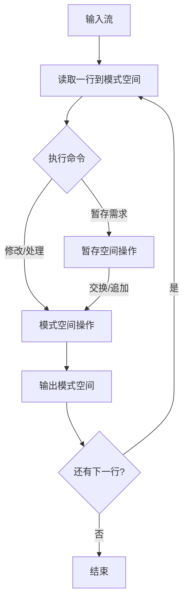

## Linux 流编辑器 sed

### 一、sed工作流程

```bash
	sed 是一种在线的、非交互式的编辑器，它一次处理一行内容。处理时，把当前处理的行存储在临时缓冲区中，称为“模式空间”（pattern space），接着用sed命令处理缓冲区中的内容，处理完成后，把缓冲区的内容送往屏幕。接着处理下一行，这样不断重复，直到文件末尾。文件内容并没有改变，除非你使用重定向存储输出。
	
典型工作流：读取行 → 模式空间 → [处理] → [可选与暂存空间交互] → 输出 → 清空模式空间 → 下一行
```



**模式空间 (Pattern Space)**  

- 每行文本的默认工作区
- 所有常规操作（如`s///`, `p`, `d`）都在此进行
- 默认会输出模式空间内容（除非用了`-n`或`d`）

**暂存空间 (Hold Space)**  

- 临时数据存储区
- 通过特殊命令交互：
  - `h`/`H`：模式空间 → 暂存空间（覆盖/追加）
  - `g`/`G`：暂存空间 → 模式空间（覆盖/追加）
  - `x`：交换两个空间内容

### 二、命令格式

```bash
sed [options] 'command' file(s)
sed [options] -f scriptfile file(s)

注：
sed和grep不一样，不管是否找到指定的模式，它的退出状态都是0
只有当命令存在语法错误时，sed的退出状态才是非0
```

快速上手

```bash
[root@node1 test]# grep  '^SELINUX=' /etc/sysconfig/selinux
SELINUX=enforcing
[root@node1 test]# sed -i '/^SELINUX=/cSELINUX=disabled' /etc/sysconfig/selinux
[root@node1 test]# grep  '^SELINUX=' /etc/sysconfig/selinux
SELINUX=disabled
```


### 三、支持正则表达式

```bash
	与grep一样，sed在文件中查找模式时也可以使用正则表达式(RE)和各种元字符。正则表达式是括在斜杠间的模式，用于查找和替换，以下是sed支持的元字符。
	
使用基本元字符集	^, $, ., *, [], [^], \< \>,\(\),\{\}
使用扩展元字符集	?, +, { }, |, ( )
```

### 四、sed基本用法

**准备实验环境**

```bash
# head passwd.txt > passwd.txt
```

```bash
# sed -r '' passwd.txt
# sed -r 'p' passwd.txt

# sed -r -n '' passwd.txt
# sed -r -n 'p' passwd.txt
# sed -r -n '/root/p' passwd.txt

# sed -r 's/root/alice/' passwd.txt
# sed -r 's/root/alice/g' passwd.txt
# sed -r 's/root/alice/gi' passwd.txt
```

```bash
要求：将/var/tmp 换成 /home/yangge
[root@tianyun ~] vim a.txt 
/var/tmp
etc

[root@tianyun ~]# sed -r 's//var/tmp//home/yangge/g' a.txt
sed：-e 表达式 #1，字符 0：no previous regular expression

[root@tianyun ~]# sed -r '/\/etc\/abc\/456/d' a.txt 

[root@tianyun ~]# sed -r 's@/var/tmp@/home/yangge@g' a.txt
[root@tianyun ~]# sed -r 's#/var/tmp#/home/yangge#g' a.txt
```

### 五、sed扩展

##### ＝＝地址

​	`地址`用于决定对哪些行进行编辑。地址形式可以是`数字`、`正则表达式` 或 `二者的结合`。如果没有指定地址，sed将处理输入文件中的所有行。

```bash
# sed -r 'd' passwd.txt	
# sed -r '3d' passwd.txt
# sed -r '1,3d' passwd.txt
# sed -r '/root/d' passwd.txt
# sed -r 's/root/alice/g' passwd.txt

# sed -r '/^adm/,6d' passwd.txt       		//从adm行开始，删除到第6行
# sed -r '/^adm/,+6d' passwd.txt    		//将adm行 和 后面的6行删除

# sed -r '2,5d' passwd.txt					//从第二行开始，删除到第5行
# sed -r '2,+5d' passwd.txt 				//将第二行 和 后面的5行删除

# sed -r '/root/d' passwd.txt				//删除含有'root'的行
# sed -r '/root/!d' passwd.txt				//删除含有'root'以外的行
# sed -r '2.5d' passwd.txt
# sed -r '2,5!d' passwd.txt

# sed -r '1~2d' passwd.txt                 //删除所有奇数行 odd-numbered
# sed -r '0~2d' passwd.txt                 //删除所有偶数行 even-numbered
```

##### ＝＝命令

​	`命令`告诉sed对指定行进行何种操作，包括打印、删除、修改等。

| 命令 | 功能                                                         |
| ---- | ------------------------------------------------------------ |
| `a`  | 在当前行后添加一行或多行                                     |
| `c`  | 用新文本修改（替换）当前行中的文本                           |
| `d`  | 删除行                                                       |
| i    | 在当前行之前插入文本                                         |
| l    | 列出非打印字符                                               |
| p    | 打印行                                                       |
| n    | 读入下一输入行，并从下一条命令而不是第一条命令开始对其的处理 |
| q    | 结束或退出sed                                                |
| !    | 对所选行以外的所有行应用命令                                 |
| `s`  | 用一个字符串替换另一个 `g`全局替换   `i `忽略大小写          |
| r    | 从文件中读                                                   |
| w    | 将行写入文件                                                 |
| y    | 将字符转换为另一字符（不支持正则表达式）                     |
| h    | 把模式空间里的内容复制到暂存缓冲区(覆盖)                     |
| H    | 把模式空间里的内容追加到暂存缓冲区                           |
| g    | 取出暂存缓冲区的内容，将其复制到模式空间，覆盖该处原有内容   |
| G    | 取出暂存缓冲区的内容，将其复制到模式空间，追加在原有内容后面 |
| x    | 交换暂存缓冲区与模式空间的内容                               |

##### ＝＝选项

| 选项 | 功能              |
| ---- | ----------------- |
| -e   | 允许多项编辑      |
| -f   | 指定sed脚本文件名 |
| -n   | 取消默认的输出    |
| -i   | inplace，就地编辑 |
| -r   | 支持扩展元字符    |

### 六、sed实用操作

```bash
yum -y install nginx vsftpd

删除配置文件中#号注释行		
sed -ri '/^#/d' /etc/nginx/nginx.conf			# 以#开头
sed -r '/^[ \t]*#/d' /etc/nginx/nginx.conf		# 以零到多个空格或tab，再加上#开头

删除配置文件中//号注释行 
sed -ri '\@^[ \t]*//@d' /etc/nginx/nginx.conf

删除无内容空行 
sed -r '/^$/d' /etc/nginx/nginx.conf
sed -r '/^[ \t]*$/d' /etc/nginx/nginx.conf

综合案例：删除注释行及空行：
sed -r '/^[ \t]*$/d; /^[ \t]*#/d' /etc/nginx/nginx.conf
sed -r '/^[ \t]*(#|$)/d' /etc/nginx/nginx.conf

修改文件示例：
sed -ri '$achroot_local_user=YES' /etc/vsftpd/vsftpd.conf 
sed -ri '$a\chroot_local_user=YES' /etc/vsftpd/vsftpd.conf 

sed -ri 's/^SELINUX=.*/SELINUX=disabled/' /etc/selinux/config 		# s命令 替换找到的内容
sed -r '/^SELINUX=/cSELINUX=disabled' /etc/selinux/config 			# c命令 替换整行

sed -ri '/#UseDNS yes/cUseDNS no' /etc/ssh/sshd_config

修改passwd.txt中adm行：家目录和shell
adm:x:3:4:adm:/var/adm:/sbin/nologin

sed -r '/^adm/ {s#/var/adm#/home/adm#; s#/sbin/nologin#/bin/bash#}' passwd.txt
```

### 七、扩展知识

```bash
添加注释：
sed -r '1,5s/^/#/' passwd.txt
sed -r '/root/ s/^/#/' passwd.txt 
sed -r '1s/^/#/; 3s/^/#/' passwd.txt

sed -r '3,5 s/(.*)/#\1/' passwd.txt			# 字符组标签()()() \1 \2 \3
sed -r '3,5 s/(.).(.*)/\1Y\2/' passwd.txt	# 将3，5行中第二个字符换成Y

sed -r '3,5 s/.*/#&/' passwd.txt            # &匹配前面查找的内容

删除注释：
sed -ri 's/^/#/' passwd.txt					# 给所有行加注释#	
sed -r '3,5 s/#(.*)/\1/' passwd.txt

暂存和取用命令：h H g G
# 将第一行复制到最后
sed -r '1h; $G' passwd.txt					# 第一行放入（覆盖）暂存空间，到最后一行从暂存空间取回（追加）到模式空间

# 将第一行移动到最后
sed -r '1{h;d}; $G' passwd.txt

# 将第二行到第5行，替换成第一行
sed -r '1h; 2,5g' passwd.txt				# 将第二行到第5行，替换成第一行

sed -r '1h; 2,3H; $G' passwd.txt			# 将1-3行复制到最后
sed -r '1{h;d}; 2,3{H;d}; $G' passwd.txt 	# 将1-3行剪切到最后
```

